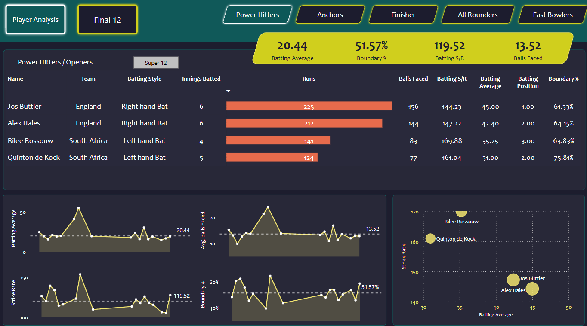
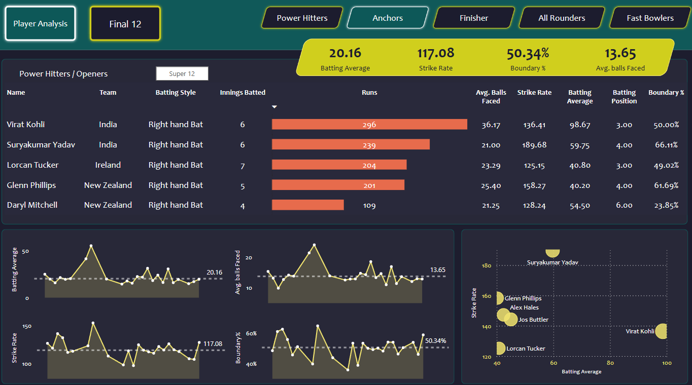
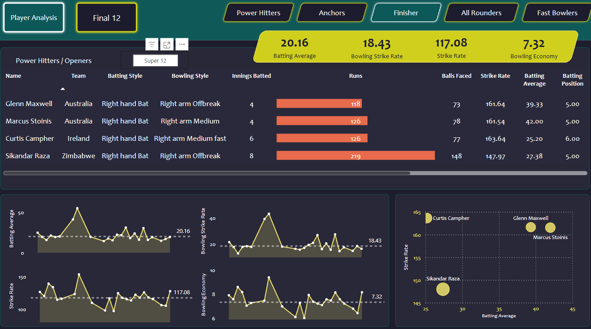
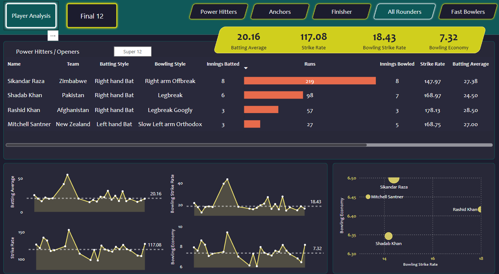
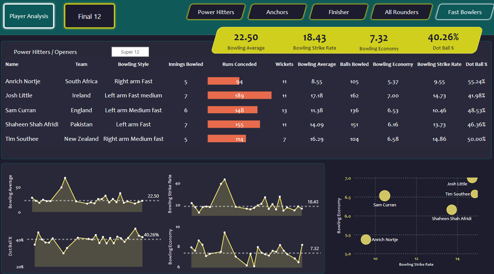
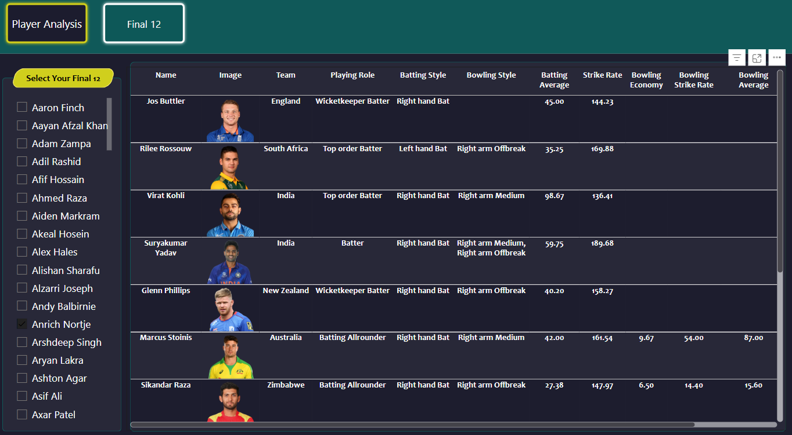
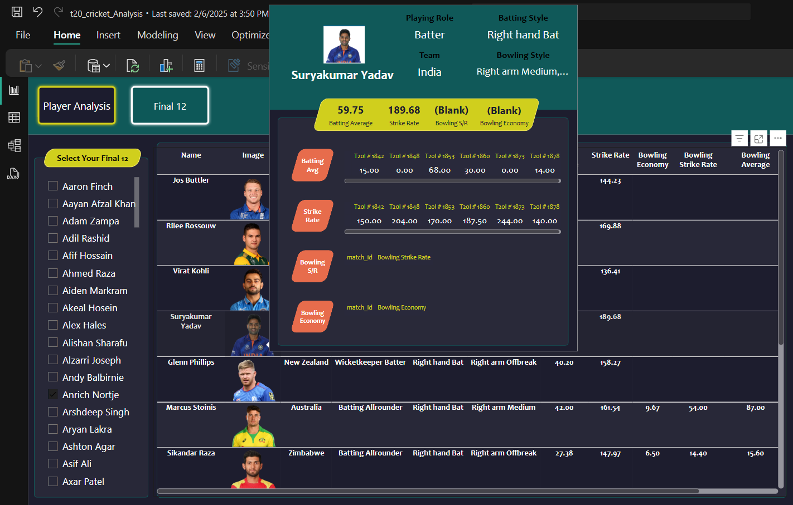

# 🏏 T20 World Cup 2022 Cricket Data Analytics Dashboard

A Power BI dashboard project that analyzes batting and bowling performances from the ICC T20 World Cup 2022 using data scraped via BrightData. The project highlights top players across categories and enables team selection using an interactive panel.

---

## 📌 Objective

To extract, transform, and visualize player-level cricket stats to generate performance insights and simulate strategic decisions like selecting a Final 12 squad based on real match data.

---

## 🔧 Tools & Technologies

- **Data Collection**: Web Scraping using [BrightData](https://brightdata.com)
- **Data Format**: JSON to CSV Conversion
- **Preprocessing**: Python, Pandas
- **Visualization**: Power BI
- **Interactivity**: Tooltips, Custom Slicers, Filters

---

## 📂 Files Included

- `t20_wc_batting_summary.js`
- `t20_wc_bowling_summary.js`
- `t20_wc_player_info.js`
- `t20_wc_match_results.js`
- `Cricket_Data_Analytics.ipynb`: Data preprocessing and JSON to CSV code

---

## 📊 Key Insights from Dashboard

- **Top Performers** by Batting Average, Strike Rate, and Economy
- **Role-Based Tabs**: Power Hitters, Anchors, All-Rounders, Finishers, Fast Bowlers
- **Final 12 Selection Panel**: Choose players based on role and performance
- **Player Tooltips**: See match-by-match metrics (batting avg, strike rate, bowling stats)

---

## 🖼️ Screenshots

### 📌 Power Hitters / Openers  

### 📌 Anchors  / Middle Order  

### 📌Finisher / Lower Order Anchor  

### 📌 All Rounders / Lower Middle Order  

### 📌 Specialist Fast Bowlers / Tail End  

### 📌 Final 12 Selection  

### 📌 Tooltip Info Panel  

---

## 🧠 What I Learned

- Real-world data preprocessing from APIs and JSON formats  
- Advanced Power BI dashboard design with dynamic visuals  
- Creating tooltips and bookmarks for deep analytics  
- How to align sports analytics to real decision-making logic (team selection)

---

## 🚀 Future Enhancements

- Add machine learning models to recommend player combinations  
- Integrate match outcomes to evaluate team formations  
- Embed dashboard into a web portal

